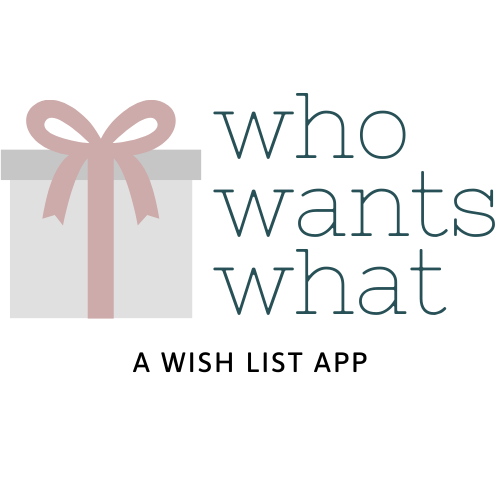

# Who Wants What 
### A Wish List App
NSS Back-End Capstone

Who Wants What is a wish list app that takes the stress out of gift-giving. Users can share their wish lists with their groups, create gift ideas for others, and track which gifts have been purchased.

App was built using C#/.NET Core with Entity and Identity Framework and styled using Bootstrap 4. Relational database was managed using SQL Server.

